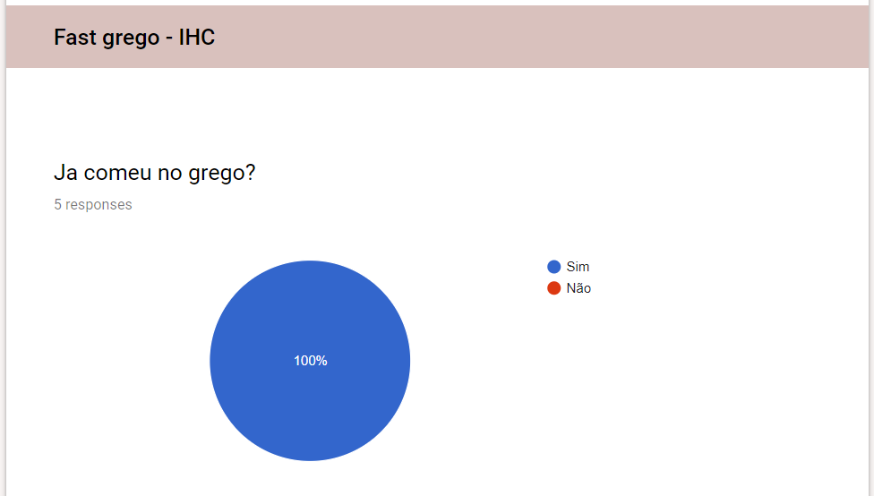
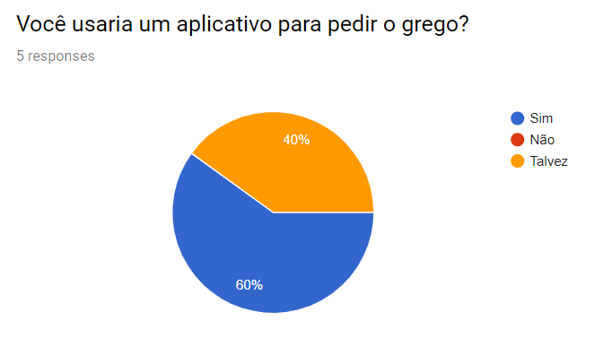

### Resultados dos Testes de Usabilidade
O nosso usuário teste testou o nosso prototipo do aplicativo, seguindo as nossas indicações sempre seguindo o roteiro ja estabelecido anteriormente, durante a realização do teste foram deitas anotações e logo após transcrito o resultado para cada uma das após questões.

## Usuário teste 01

Nome: Angelo  
Profissão: Estagiario TCU / Estudante 
Idade: 22 anos

- Encontre algo que ache interessante e efetue uma compra.

O usuário conseguiu realizar essa tarefa rapidamente 

- Se cadastre no app.

Inicialmente ele ja se deparou com esta questão e antes de realizar a compra ja simulou a o cadastro.

- Adicione uma foto de perfil para o seu usuário.

Esta questão foi desqualificada do teste pois não estava no escopo do prototipo, porem ao fim foi dito que ele esperava que no momento do cadastro fosse possibilitado isto.

- Voce ja é cadastrado e perdeu a sua senha. Tente recupera-la.

Esta questão foi desqualificada do teste pois não estava no escopo do prototipo, ele comentou que isto segue um padrão e que deveriamos fazer desta mesma forma.

- Peça uma marmita no grego com mandioca, arroz, carne grego, e feijão tropeiro e pague da forma que preferir.

Esta operação foi realizada facilmente.

- Faça um pedido para buscar no outro dia.

O usuário ao fim comentou que esta questão não fazia muito sentido ou que ao menos não ficou muito claro pois ao fim da comprar ele imaginou que poderia usar o QRcode em qualquer dia.

- Faça um comentario sobre o seu pedido.

Nesta parte foi condundido a opção observação com comentario.

- Você ja preencheu o cartão fidelidade faça uso dele para comprar algo do seu interesse.

Ja conhecia esta funcionalidade de outros locais e gostou de ver isso.

- Faça de conta que vc ja efetuou o pagamento e agora o 

QRcode lhe foi solicitado, mostre-o.
ele ja tinha passado por esta tela no momento da compra e quando esta questão foi feita ele achou com facilidade

### Obsevação:

Um pouco após o teste ser realizado foi perguntado ao participante como ele categorizaria a aplicação de 0 a 10 sendo 0 uma opção uma opção inviavel e 10 atende todas as espectativas.

Ele classificou com **9** pois sentiu falta da foto

## Usuário teste 02

Nome: André  
Profissão: Estudante - FGA/Unb 
Idade: 21 anos

Teste realizado no dia 27/06/2019 via hangouts.

Link da gravação do teste remoto pode ser encontrado [aqui](https://www.youtube.com/watch?v=2rcjVzRn5p0).

**Contexto** 

Você é um aluno da FGA e ta querendo fazer o uso do aplicativo fast grego para fazer uma refeição

**Principais FeedBacks do Usuário**

- Interface Elegante

- Simples utilização, poucos cliques para realizar as tarefas

- Fluidez no uso

**Principais Propostas de melhoria do Usuário**

- Poderia ser um pouco mais intuitivo em relação a achar o QRCode.

**Resultados Observados pelo Moderador**

- O tempo médio para realização das tarefas foi de 38 segundos.

- Dificuldade por parte do usuário em saber se o produto foi adicionado à sacola.

- O usuário teve dificuldade em entender o que são os pedidos expirados

- O usuário ficou satisfeito com a interface da aplicação

- O usuário elogiou funcionalidades como: cartão fidelidade, formas de pagamento e achou bem fácil utilizá-las.

## Resultados obtidos no questionario

